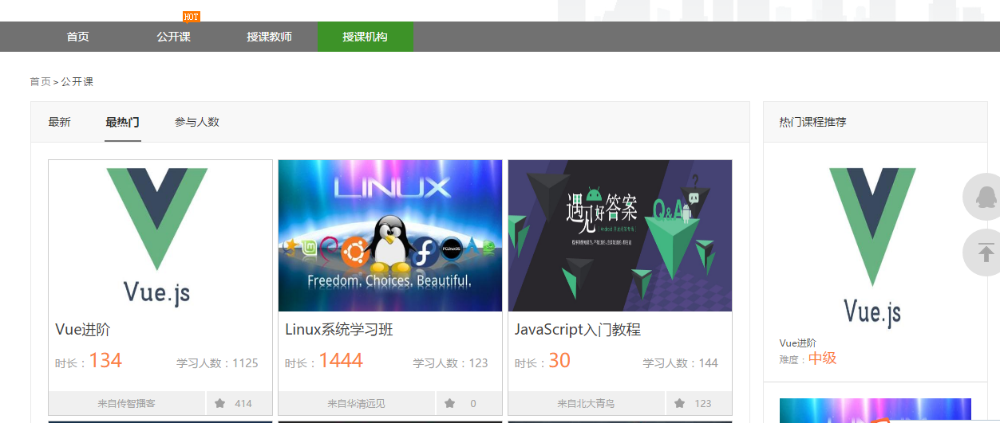
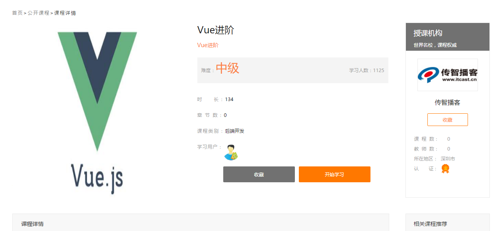
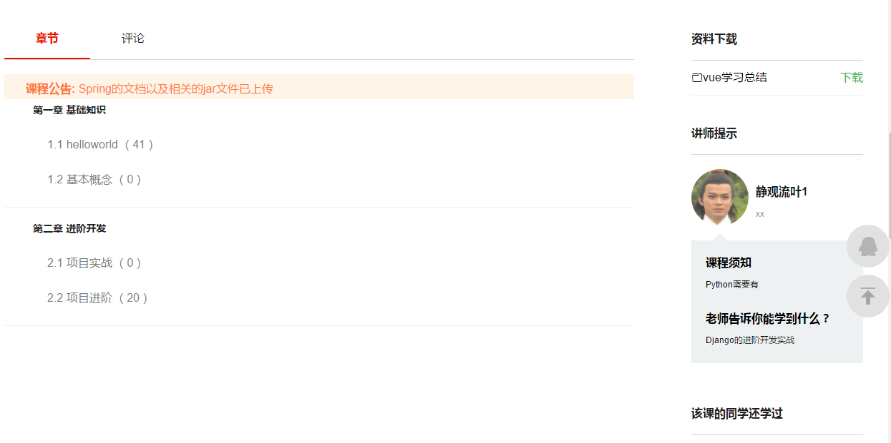
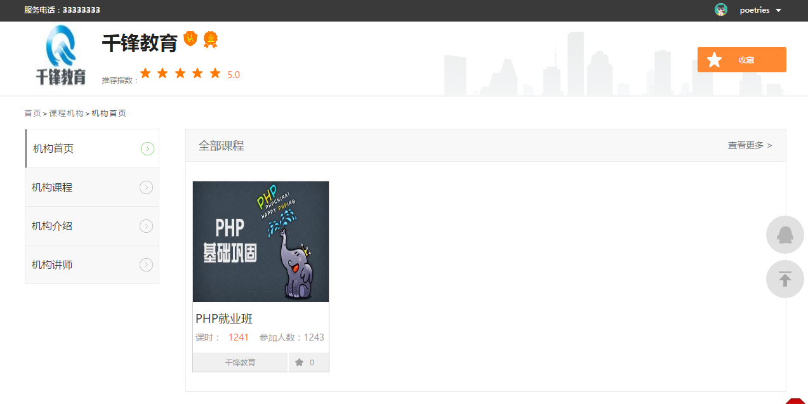
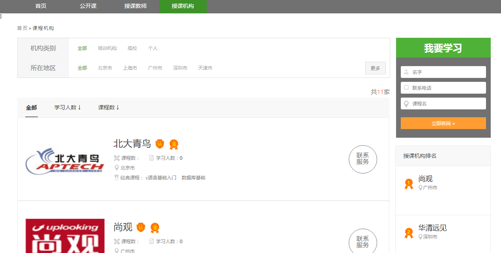
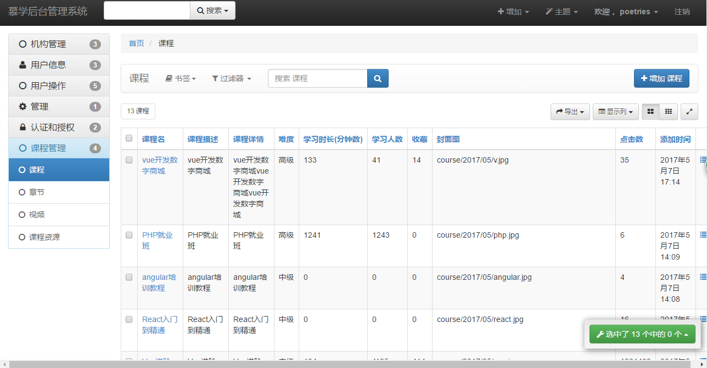

### 基于Django+xadmin的一个后台管理系统


实现功能
---


开发环境
---

- visualenv
- Python 3.5
- Django 1.9.0
- xadmin 0.6.1

启动项目
---

**第一步：配置数据库**

- 确保你已经安装了 `MySQL`
- 在`settings.py` 里填入你的数据库信息
- 生成数据表（打开pycharm，Tools->Run manage.py Task,然后依次输入 `makemigrations` `migrate`生成数据表到数据库中）

```
DATABASES = {
   'default': {
       'ENGINE': 'django.db.backends.mysql',
       'NAME': 'imooc',
       'USER': 'root', 
       'PASSWORD': 'root',
       'HOST': '127.0.0.1',
   }
}
```

**第二步：安装相应的包**

```
distribute (0.7.3)
Django (1.9)
django-crispy-forms (1.6.1)
django-formtools (2.0)
django-pure-pagination (0.3.0)
django-reversion (2.0.8)
django-simple-captcha (0.4.6)
httplib2 (0.9.2)
mysqlclient (1.3.10)
olefile (0.44)
Pillow (4.0.0)
pip (9.0.1)
setuptools (28.8.0)
six (1.10.0)
wheel (0.29.0)
```

ScreenShot
---

- 前台









- 后台




演示
---


